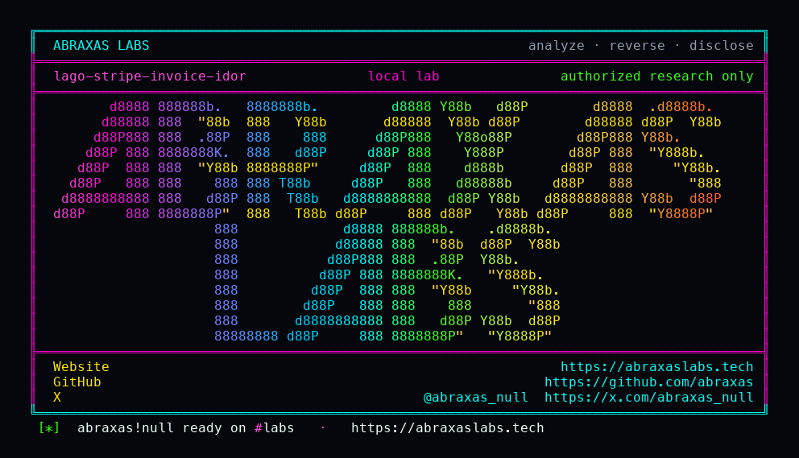

<p align="center">
  
</p>

<p align="center">
  <a href="https://abraxaslabs.tech"><strong>abraxaslabs.tech</strong></a>
  &nbsp;·&nbsp;
  <a href="https://github.com/abraxas">github.com/abraxas</a>
  &nbsp;·&nbsp;
  <a href="https://x.com/abraxas_null">@abraxas_null</a>
  &nbsp;·&nbsp;
  <a href="mailto:abraxas.null@proton.me">abraxas.null@proton.me</a>
  &nbsp;·&nbsp;
  <a href="https://github.com/abraxas/lago-stripe-invoice-idor">lago-stripe-invoice-idor</a>
</p>

# lago-stripe-invoice-idor

**Lago** `v1.53.0` - GetLago

[`POST /webhooks/stripe/:organization_id`](https://github.com/getlago/lago-api/blob/v1.53.0/config/routes.rb) verifies `Stripe-Signature` with **that URL org's** webhook secret. Then the one-time branch in [`StripeService#update_payment_status`](https://github.com/getlago/lago-api/blob/v1.53.0/app/services/invoices/payments/stripe_service.rb) loads the invoice with `Invoice.find_by(id:)` and **no** `organization_id`. `handle_missing_payment` is scoped. Adyen invoices already pass `organization_id:`. Cashfree and Flutterwave copy the unscoped Stripe `find_by(id:)`. This lab is Stripe.

**Another tenant on the same database, with Stripe connected, can mark your invoice paid. Their Stripe dashboard has no matching charge. Yours might.**

| | |
|---|---|
| ID | no CVE yet |
| CWE | [CWE-639](https://cwe.mitre.org/data/definitions/639.html), [CWE-345](https://cwe.mitre.org/data/definitions/345.html) |
| CVSS | **High: 7.7** `CVSS:3.1/AV:N/AC:L/PR:L/UI:N/S:C/C:N/I:H/A:N` |
| Product | [Lago](https://github.com/getlago/lago) / [lago-api](https://github.com/getlago/lago-api) |
| Affected | through **v1.53.0** Stripe one-time webhook; shared database |
| Auth | attacker org with Stripe connected; victim invoice UUID |
| License | [GNU Affero GPL v3.0](LICENSE) |
| Lab | `127.0.0.1` only |

## What an attacker can do

Sign a `payment_intent.succeeded` as **their** org, put `payment_type=one-time` and `lago_invoice_id` of **your** invoice. The scoped path never runs. The victim row becomes `payment_status=succeeded`. Wallet top-up / payment-gated sub unlocks.

Not unauthenticated. Not a shell. Single-org self-host is not this bug: that signing secret already owns that org's payables. You need a victim invoice UUID (portal URL, email, PDF, leaked API) and a victim `stripe_customer` row. Dummy event. No live Stripe.

Same tree as the [acceptInvite ATO](https://github.com/abraxas/lago-invite-ato). Different bug.

## How I found it

I read `update_payment_status`, then the one-time `create_payment` `find_by(id:)`, then `handle_missing_payment`'s `organization_id:`. The comment on the scoped path is afraid of the same Stripe secret used across orgs. The one-time branch forgot to be afraid.

The first client that looks at this will POST a `payment_intent.succeeded` without `payment_type`. `handle_missing_payment` looks up the invoice **and** `organization_id`. Attacker org, victim invoice. `nil`. Pending. That is the control. Lab asserts it.

Wrong turns already recorded: signing with the **victim** webhook secret (then you already own that merchant's payables); single-org self-host; invoice UUID from the attacker org (in-org payment); no `stripe_customer` on the victim (exception, not `succeeded`); treating webhook HTTP 200 as the oracle (the job is async - poll `GET /api/v1/invoices/:id`); a reverse shell. Theatre.

Then: two `registerUser` calls plant Victim Corp and Attacker Corp. Victim REST key creates an add-on, a customer, and an unpaid invoice with `skip_psp` so I did not need a live PSP to mint the row. `seed_stripe.rb` plants Stripe providers and a `stripe_customer` on the victim. Dummy `webhook_secret`. Dummy `sk_test_lab_*`. Signed control event, no `payment_type`: still pending. Signed event with `payment_type=one-time`: `succeeded`, `paid=1000`.

## Lab

```bash
cd lab
./run.sh
```

Target **only** `http://127.0.0.1:13001`. Invite ATO used **13000**. This one does not share a volume with that lab.

```text
IOC payment_status_before=pending
IOC control webhook (no payment_type) payment_status_after_control=pending
IOC attack webhook payment_type=one-time
IOC poll payment_status=succeeded paid=1000
SUCCESS Lago Stripe one-time webhook unscoped invoice
```

## The fix

`Invoice.find_by(id:, organization_id:)` on the one-time path, the way `handle_missing_payment` and Adyen invoices already do. Same for Cashfree/Flutterwave.

## References

- [github.com/getlago/lago](https://github.com/getlago/lago) tag [v1.53.0](https://github.com/getlago/lago/releases/tag/v1.53.0) · [lago-api](https://github.com/getlago/lago-api)
- [`webhooks_controller.rb`](https://github.com/getlago/lago-api/blob/v1.53.0/app/controllers/webhooks_controller.rb) · [`stripe_service.rb`](https://github.com/getlago/lago-api/blob/v1.53.0/app/services/invoices/payments/stripe_service.rb) · [`adyen_service.rb`](https://github.com/getlago/lago-api/blob/v1.53.0/app/services/invoices/payments/adyen_service.rb) · [`cashfree_service.rb`](https://github.com/getlago/lago-api/blob/v1.53.0/app/services/invoices/payments/cashfree_service.rb) · [`flutterwave_service.rb`](https://github.com/getlago/lago-api/blob/v1.53.0/app/services/invoices/payments/flutterwave_service.rb)
- Same product: [lago-invite-ato](https://github.com/abraxas/lago-invite-ato)
- [CWE-639](https://cwe.mitre.org/data/definitions/639.html) · [CWE-345](https://cwe.mitre.org/data/definitions/345.html)

## License

GNU Affero GPL v3.0. See [LICENSE](LICENSE). Loopback lab only. No warranty.
